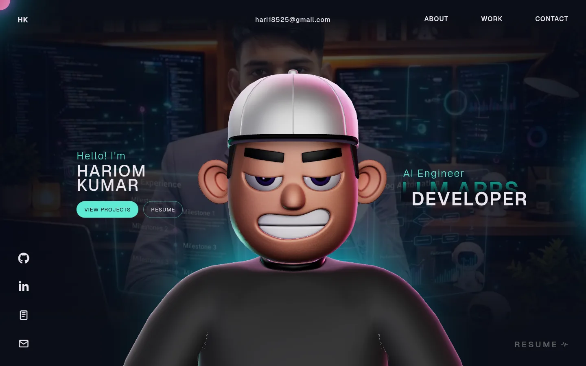

# Hariom Kumar · Portfolio

Personal site of **Hariom Kumar**: AI Engineer at Adhyay AI and BS Data Science student at IIT Madras, building LLM applications, RAG systems and full-stack web apps.

**Live:** https://hariomkr147.vercel.app · **Resume:** [`public/resume.pdf`](public/resume.pdf)



## Stack

React 18 · TypeScript · Vite · Three.js (3D avatar) · react-three-fiber + Rapier (tech-stack physics) · GSAP (ScrollTrigger, ScrollSmoother, SplitText)

## Run locally

```bash
npm ci
npm run dev      # http://localhost:5173
npm run lint
npm run build && npm run preview
```

Requires Node 18+.

## Editing content

All recruiter-facing content lives in [`src/data/profile.ts`](src/data/profile.ts): links, projects, other work and the tech stack. Adding a project is one object in the `projects` array; if it has no screenshot it gets a styled title card.

Other copy lives in `src/components/About.tsx`, `Career.tsx`, `WhatIDo.tsx`, `Landing.tsx` and the loading marquee in `Loading.tsx`. SEO and link-preview tags are in `index.html` (update the domain there, in `public/robots.txt` and `public/sitemap.xml` if you deploy somewhere else).

## Notes

- The 3D avatar is Draco-compressed and lightly obfuscated (`public/models/character.enc`). To swap it, export a GLB and run `node scripts/encrypt-model.cjs your-model.glb`.
- If WebGL is unavailable or the model fails to load, the site still reveals itself (after at most 15 s) without the avatar, and the tech stack falls back to a static grid.
- Motion is reduced for visitors with `prefers-reduced-motion` enabled.

## Credits

Built on the open-source 3D portfolio template by Rajesh Chityal (MIT), via a fork by Jyoti Sinha. Content, projects and later changes by Hariom Kumar.

## License

[MIT](LICENSE)
